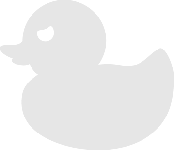

  

<h1 align="center" style="margin-top: 20px;"> Deep Duck </h1>

## What?
Deep duck is an engine to evaluate and sugest moves for the duck chess variant.

## What is duck chess?
Duck Chess is a chess variant invented by Dr. Tim Paulden in 2016. The game follows most regular chess rules but adds a dynamic component to the mix: a rubber duck that both players can move.
You can learn more about it [here](https://www.chess.com/terms/duck-chess) and play some duckchess in [chess.com](https://www.chess.com/variants/duck-chess) or in [pychess](https://www.pychess.org/).

## Nice, how it works? 
This was implemented in rust using the old fashioned way: 
- testing (almost) every move possible
- repeat this process for you and your enemy some times
- then a hand crafted evaluation to see if the outcome is a good position for you

## Wait, is this a conversation with yourself?
Maybe. Next question.

## How can I use this?
In the future you will play it [here](https://andrefpf.github.io/duckmate/), but it is not working yet.

In the meantime you can compile and run the CLI, then put in the FEN of your chess position. The engine will show the position and say the best the best movement it finds.

To help you with the FEN stuff use this [nice editor](https://www.pychess.org/editor/duck) from pychess, then copy and paste the FEN code.

    Your FEN position: 8/3*4/8/8/8/4K3/8/7k w - - 0 1 q
    8                 
    7       🐤         
    6                 
    5                 
    4                 
    3         ♚       
    2                 
    1               ♔ 
    A B C D E F G H
    Move: E3 to F2 and duck to H2
    Time elapsed: 38.60762ms

## How can I compile it?
You will need Cargo. Then run this in your terminal: 

    cargo run --release

It is important to use the --release, because chess engine is a very time consuming task and every optimization is wellcome.

## Is it a good chess engine?
Better than me.